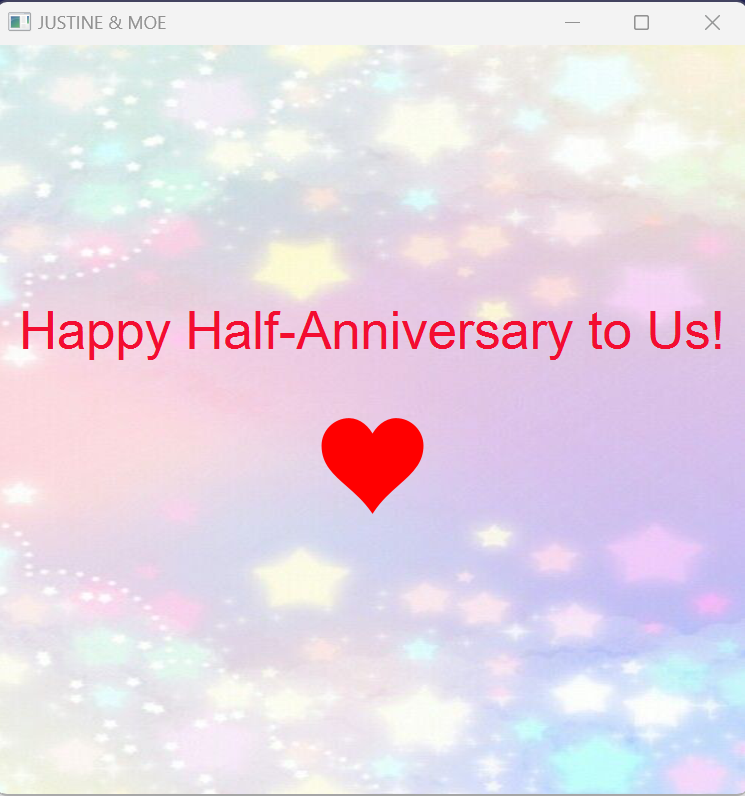
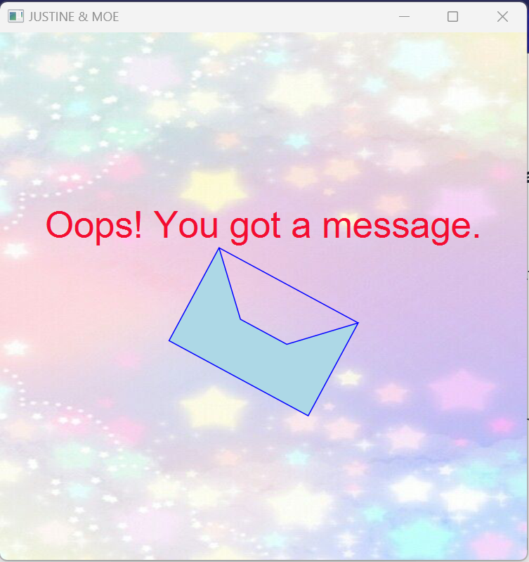
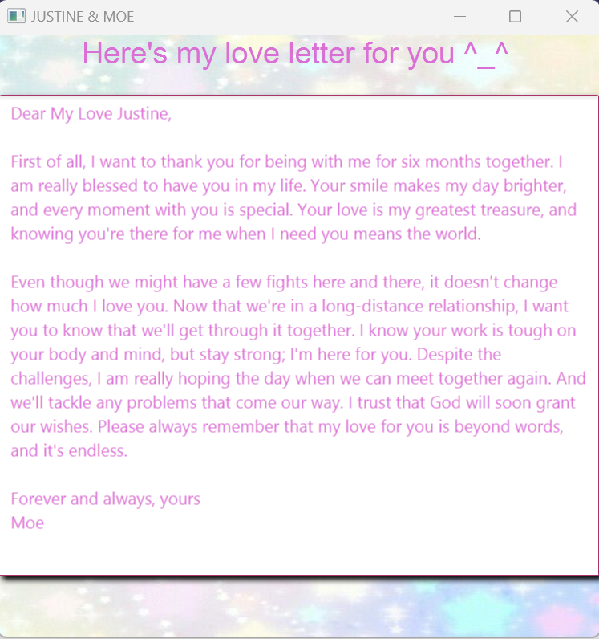

Simple Love Letter 

This project is a simple JavaFX application that shows a love letter's simple electronic UI design.
There are three pages. You can see it in the following screenshots.

On the first page, the beating heart can be touched. The second page will be displayed.

On the Second page, the envelope can be touched. The third page will be displayed

